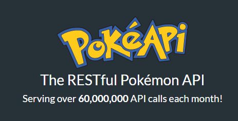

# Pokedex Exercise

First of all I took the resource from these 2 sites:
> 1. 
[Poke API Website](https://pokeapi.co/)  
They provide everything about pokemon!  

> 2.   
[Bulbapedia Website](https://bulbapedia.bulbagarden.net/wiki/List_of_Pok%C3%A9mon_by_name)  
I use this website for scraping pokemon images, they have bigger image
